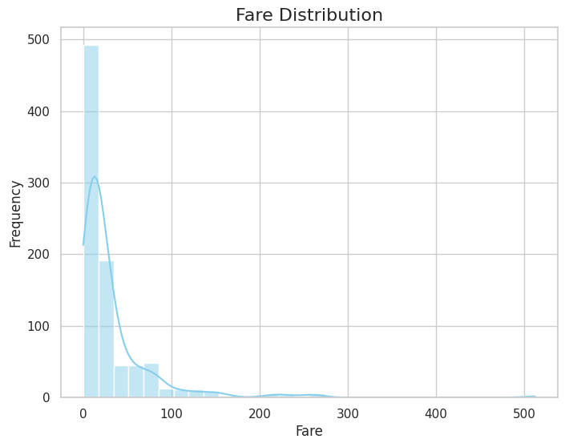

# Summary Report

## Summary Statistics:
shape: (9, 9)
┌────────────┬──────────┬──────────┬────────────┬───┬───────────┬───────────┬───────────┬──────────┐
│ statistic  ┆ Survived ┆ Pclass   ┆ Name       ┆ … ┆ Age       ┆ Siblings/ ┆ Parents/C ┆ Fare     │
│ ---        ┆ ---      ┆ ---      ┆ ---        ┆   ┆ ---       ┆ Spouses   ┆ hildren   ┆ ---      │
│ str        ┆ f64      ┆ f64      ┆ str        ┆   ┆ f64       ┆ Aboard    ┆ Aboard    ┆ f64      │
│            ┆          ┆          ┆            ┆   ┆           ┆ ---       ┆ ---       ┆          │
│            ┆          ┆          ┆            ┆   ┆           ┆ f64       ┆ f64       ┆          │
╞════════════╪══════════╪══════════╪════════════╪═══╪═══════════╪═══════════╪═══════════╪══════════╡
│ count      ┆ 887.0    ┆ 887.0    ┆ 887        ┆ … ┆ 887.0     ┆ 887.0     ┆ 887.0     ┆ 887.0    │
│ null_count ┆ 0.0      ┆ 0.0      ┆ 0          ┆ … ┆ 0.0       ┆ 0.0       ┆ 0.0       ┆ 0.0      │
│ mean       ┆ 0.385569 ┆ 2.305524 ┆ null       ┆ … ┆ 29.471443 ┆ 0.525366  ┆ 0.383315  ┆ 32.30542 │
│ std        ┆ 0.487004 ┆ 0.836662 ┆ null       ┆ … ┆ 14.121908 ┆ 1.104669  ┆ 0.807466  ┆ 49.78204 │
│ min        ┆ 0.0      ┆ 1.0      ┆ Capt.      ┆ … ┆ 0.42      ┆ 0.0       ┆ 0.0       ┆ 0.0      │
│            ┆          ┆          ┆ Edward     ┆   ┆           ┆           ┆           ┆          │
│            ┆          ┆          ┆ Gifford    ┆   ┆           ┆           ┆           ┆          │
│            ┆          ┆          ┆ Crosby     ┆   ┆           ┆           ┆           ┆          │
│ 25%        ┆ 0.0      ┆ 2.0      ┆ null       ┆ … ┆ 20.5      ┆ 0.0       ┆ 0.0       ┆ 7.925    │
│ 50%        ┆ 0.0      ┆ 3.0      ┆ null       ┆ … ┆ 28.0      ┆ 0.0       ┆ 0.0       ┆ 14.4542  │
│ 75%        ┆ 1.0      ┆ 3.0      ┆ null       ┆ … ┆ 38.0      ┆ 1.0       ┆ 0.0       ┆ 31.275   │
│ max        ┆ 1.0      ┆ 3.0      ┆ the        ┆ … ┆ 80.0      ┆ 8.0       ┆ 6.0       ┆ 512.3292 │
│            ┆          ┆          ┆ Countess.  ┆   ┆           ┆           ┆           ┆          │
│            ┆          ┆          ┆ of (Lucy   ┆   ┆           ┆           ┆           ┆          │
│            ┆          ┆          ┆ Noel Ma…   ┆   ┆           ┆           ┆           ┆          │
└────────────┴──────────┴──────────┴────────────┴───┴───────────┴───────────┴───────────┴──────────┘

## Mean Values:
- **Survived**: 0.3855693348365276
- **Pclass**: 2.305524239007892
- **Age**: 29.471443066516347
- **Siblings/Spouses Aboard**: 0.5253664036076663
- **Parents/Children Aboard**: 0.3833145434047351
- **Fare**: 32.305420180383315

## Median Values:
- **Survived**: 0.0
- **Pclass**: 3.0
- **Age**: 28.0
- **Siblings/Spouses Aboard**: 0.0
- **Parents/Children Aboard**: 0.0
- **Fare**: 14.4542

## Standard Deviation:
- **Survived**: 0.4870041177510123
- **Pclass**: 0.8366620036697732
- **Age**: 14.12190840546256
- **Siblings/Spouses Aboard**: 1.1046685538675702
- **Parents/Children Aboard**: 0.8074659070316832
- **Fare**: 49.78204040017391

## Distributions:

